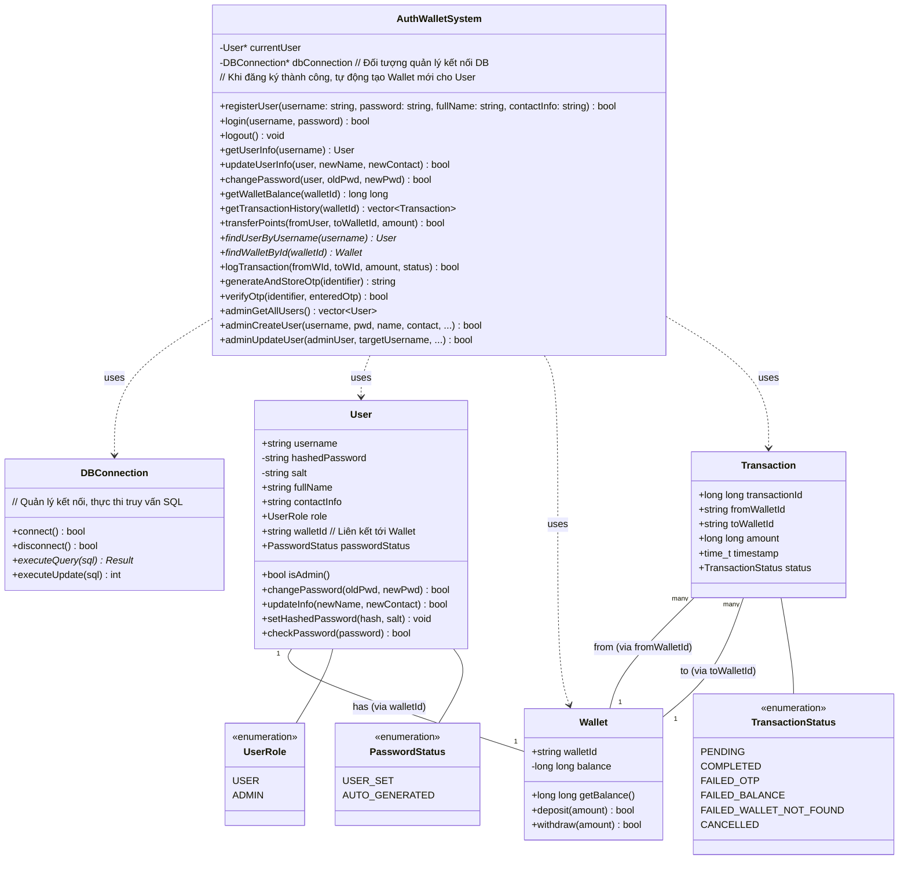

```mermaid
classDiagram
    class User {
        +string username
        -string hashedPassword
        -string salt
        +string fullName
        +string contactInfo
        +UserRole role
        +string walletId  // Liên kết tới Wallet
        +PasswordStatus passwordStatus
        +bool isAdmin()
        +changePassword(oldPwd, newPwd) bool
        +updateInfo(newName, newContact) bool
        +setHashedPassword(hash, salt) void
        +checkPassword(password) bool
    }

    class Wallet {
        +string walletId
        -long long balance
        +long long getBalance()
        +deposit(amount) bool
        +withdraw(amount) bool
    }

    class Transaction {
        +long long transactionId
        +string fromWalletId
        +string toWalletId
        +long long amount
        +time_t timestamp
        +TransactionStatus status
    }

    class AuthWalletSystem {
        -User* currentUser
        -DBConnection* dbConnection // Đối tượng quản lý kết nối DB
        +registerUser(username: string, password: string, fullName: string, contactInfo: string) bool
        // Khi đăng ký thành công, tự động tạo Wallet mới cho User
        +login(username, password) bool
        +logout() void
        +getUserInfo(username) User
        +updateUserInfo(user, newName, newContact) bool
        +changePassword(user, oldPwd, newPwd) bool
        +getWalletBalance(walletId) long long
        +getTransactionHistory(walletId) vector~Transaction~
        +transferPoints(fromUser, toWalletId, amount) bool
        +findUserByUsername(username) User*
        +findWalletById(walletId) Wallet*
        +logTransaction(fromWId, toWId, amount, status) bool
        +generateAndStoreOtp(identifier) string
        +verifyOtp(identifier, enteredOtp) bool
        +adminGetAllUsers() vector~User~
        +adminCreateUser(username, pwd, name, contact, ...) bool
        +adminUpdateUser(adminUser, targetUsername, ...) bool
    }

    class DBConnection {
        // Quản lý kết nối, thực thi truy vấn SQL
        +connect() bool
        +disconnect() bool
        +executeQuery(sql) Result*
        +executeUpdate(sql) int
    }

    class UserRole {
      <<enumeration>>
      USER
      ADMIN
    }

    class PasswordStatus {
      <<enumeration>>
      USER_SET
      AUTO_GENERATED
    }

    class TransactionStatus {
      <<enumeration>>
      PENDING
      COMPLETED
      FAILED_OTP
      FAILED_BALANCE
      FAILED_WALLET_NOT_FOUND
      CANCELLED
    }

    AuthWalletSystem ..> DBConnection : uses
    AuthWalletSystem ..> User : uses
    AuthWalletSystem ..> Wallet : uses
    AuthWalletSystem ..> Transaction : uses
    User "1" -- "1" Wallet : has (via walletId)
    Transaction "many" -- "1" Wallet : from (via fromWalletId)
    Transaction "many" -- "1" Wallet : to (via toWalletId)
    User -- UserRole
    User -- PasswordStatus
    Transaction -- TransactionStatus
```